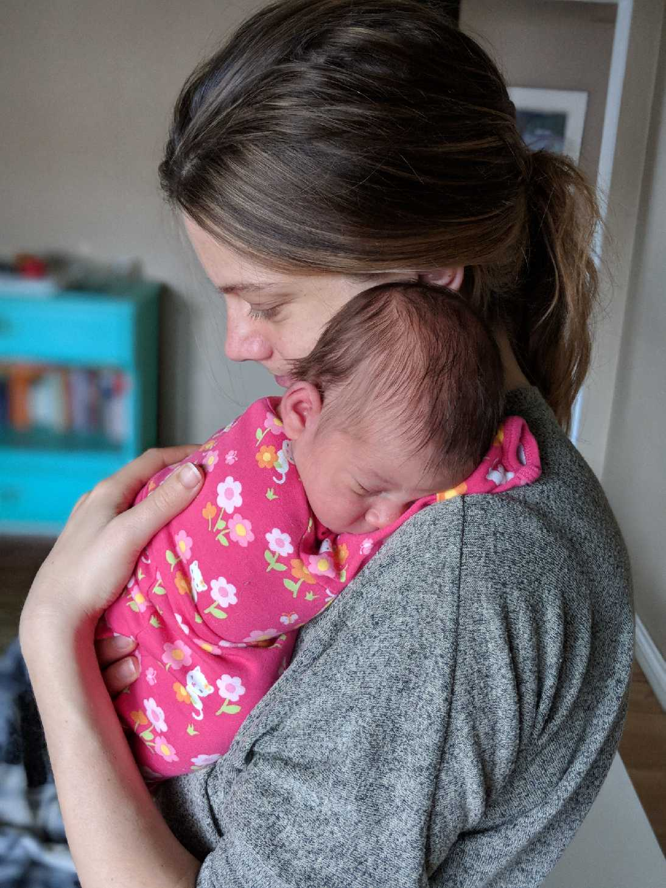

I’m back at work in exactly two months. I will have been off for a year at that point, living a life of leisure (lol 😐) taking care of a baby.

My emotions are mixed!

✨ I’m excited, because I enjoy working (although let’s be honest, back when I left for maternity leave last year I was also very excited for a break from working 😇) and taking care of a baby is… well, it’s not so bad, but it’s pretty all-consuming so it will be nice to get away and do something else.

✨ I’m also excited because I really like my coworkers and spending time with them is kind of like spending time with friends. Is that sad? Is that weird? Please tell me that it is neither sad nor weird.

😢 On the other hand, I’m sad because I’m going to be away from Little P **so much**, and I have never been apart from her for more than an hour or two here and there.

<figure>
    
    <figcaption>
        Me and baby P a day or two after she was born
    </figcaption>
</figure>

😢 AND: Unless I take another year off for another baby (which may or may not happen, both a second baby and my decision for how much time to take for maternity leave – husband and I are seriously considering having him take the majority of the leave next time, if there is a next time) this may be the ONLY time in my life when I get such a large chunk of time off work… until I retire 😬

🧟‍♀️ Finally, going back to work is terrifying for a reason I hadn’t anticipated: Baby still wakes up multiple times per night, so I am often very sleep deprived and my brain is not firing on all cylinders. This makes me both dumb AND grumpy, a really excellent combination. I don’t mind subjecting Ben to my stupid, angry self, but I do feel bad doing that to my coworkers. I naively thought that by age one things would be pretty good in the sleep department. OH HOW WRONG I WAS.

So. I’m not really sure how it’s all going to go down!

Lucky my employer is excellent and I know they’ll be very supportive during the transition back to work ❤️

Still, it will be interesting. Hopefully it is relatively smooth sailing.

In news that is absolutely not news to *anyone*, juggling a career and kids as a woman is kind of shitty. Your attention is so split between family and work, you’re sleep deprived, and you have to take time off work every time you have a baby which puts you at a disadvantage for promotions and just staying current in the industry (🙄). I know some men might say they have it tough too, and I’m sure they do, but just looking at my own family situation: I have it WAY worse than my husband does, no doubt. And I’m so torn, because on the one hand I really love my job and want to pursue it to the fullest, but on the other hand I’m like “When I die, what will I regret more: Time not spent with my children or a career unfulfilled?” And the answer is pretty obvious in that context.

That said, I am very thankful I am in a situation where I _can_ take a year off. I cannot imagine having to go back to work only a few weeks after giving birth. I would have been a total mess.

I’ll try to write an update on how it all looks in reality once I’m back and in the swing of things 😊
