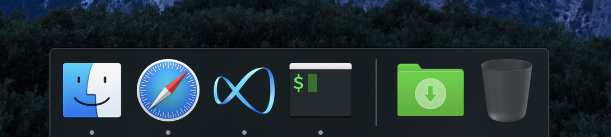
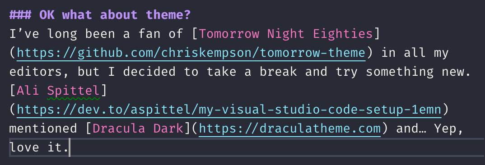
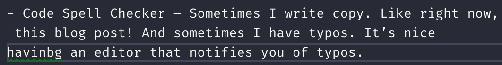
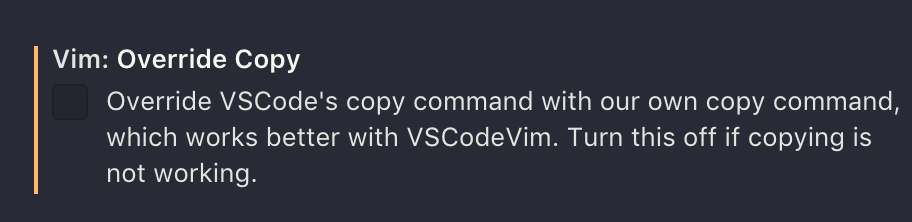

To me, 2018 (the year I was/am off on maternity leave) was the year that [VS Code](https://code.visualstudio.com) *really* blew up in popularity.

So although I had switched to [Atom](http://atom.io) from [Sublime Text](https://www.sublimetext.com) a year or two earlier, I decided to switch AGAIN… because no one is nearly as obsessed with Atom like they are for VS Code and since now Microsoft owns both editors, I might as well switch to the preferred child.

**And** since I’m not working at the moment and have a bit of time during baby naps to nerd out, I got to spend a lot of time researching and getting my setup _just_ right.

I wasn’t totally sure about writing this blog post because it seems a bit frivolous and self-centered to write about my setup? Especially because there’s already a zillion similar posts out there already.

BUT I have decided to shut that inner voice of doubt down because:

1. STFU mean self-talk

and

2. I really enjoy reading other people’s posts about their setups. I have read a LOT of them. So obviously there are people (like me) who DO enjoy reading this kind of thing!

## First up: The icon

I’m not usually one to replace app icons, it just seems a bit… extreme? Like it feels more pure to stick with how the vendor intended it to be. But I really didn’t like the existing icon and decided to break my usual rule 😄 (actually, as you can see in the screenshot I went a bit crazy and also updated some of the Finder folders so I guess I am breaking all the rules these days.)

I ended up going with [this icon by Lex Tang](https://dribbble.com/shots/3169976-Visual-Studio-Code-Icon-Revamp). It looks pretty good:

## OK what about theme?
I’ve long been a fan of [Tomorrow Night Eighties](https://github.com/chriskempson/tomorrow-theme) in all my editors, but after many years, I thought it was probably time to try something new. [Ali Spittel](https://dev.to/aspittel/my-visual-studio-code-setup-1emn) mentioned [Dracula](https://draculatheme.com) and… Yep, love it.

## And extensions

Since I’m not coding a TON right now I actually don’t know exactly what will prove to be most useful, but I installed the ones that seem like they make the most sense, and from the limited use I’ve had with them so far, they have been great.

### For writing copy, like I am right now

- [:emojisense:](https://marketplace.visualstudio.com/items?itemName=bierner.emojisense) – Great for quickly inserting an emoji 😁 I am fine with using the mac keyboard shortcut (`⌘^space`) a lot of the time, but since I do also have some muscle memory from Slack and Github I liked the idea of having the colon syntax available to me too. (plus, is it just me or is the mac shortcut kind of buggy sometimes?)
- [Code Spell Checker](https://marketplace.visualstudio.com/items?itemName=streetsidesoftware.code-spell-checker) – Sometimes I have typos. It’s nice having an editor that notifies you of typos.

### For writing code

- [ESLint](https://marketplace.visualstudio.com/items?itemName=dbaeumer.vscode-eslint) – A no–brainer if you use ESLint in your code to have your editor auto–notify you of transgressions.
- [GitLens](https://marketplace.visualstudio.com/items?itemName=eamodio.gitlens) – if you use Git for version control it’s nice to have history and diffs displayed right in the editor. Some people LOVE this feature, I’ve always been slightly take–it–or–leave–it about it but it seems better to have it than not, overall.
- [Path IntelliSense](https://marketplace.visualstudio.com/items?itemName=christian-kohler.path-intellisense) – autocompletes filenames for you, which is especially great if you are working with large JS projects that require you to `import` from files.
- [React PropTypes IntelliSense](https://marketplace.visualstudio.com/items?itemName=OfHumanBondage.react-proptypes-intellisense) – Autocomplete props when passing props around in [React](https://reactjs.org). Handy if you write React code, useless if you don’t 🙃
- [SASS IntelliSense](https://marketplace.visualstudio.com/items?itemName=mrmlnc.vscode-scss) – I think most devs don’t use [SASS syntax](https://sass-lang.com) anymore, correct me if I’m wrong? I rarely see it in the wild these days! But at [Flow](https://www.getflow.com) we still do and I don’t think we’ll be changing it any time soon, so it’s nice to have this.
- [SCSS IntelliSense](https://marketplace.visualstudio.com/items?itemName=mrmlnc.vscode-scss) – for non-Flow projects I use SCSS most of the time, so need this too!
- [VS Live Share](https://marketplace.visualstudio.com/items?itemName=MS-vsliveshare.vsliveshare) – I haven’t used this yet but I saw it recommended in another blog post (which one: I have forgotten 😢) and I liked the idea so  much I decided to add it in hopes I could one day use it for pair programming.
- [VS Code Vim](https://marketplace.visualstudio.com/items?itemName=vscodevim.vim) – I am not a hardcore vim user but I like having the shortcuts available to me sometimes. I turned off the setting to switch out of insertion mode on copy though as I found that irritating. As a non power-user of Vim I like being in insertion mode unless I explicitly `esc` out.

❤️
